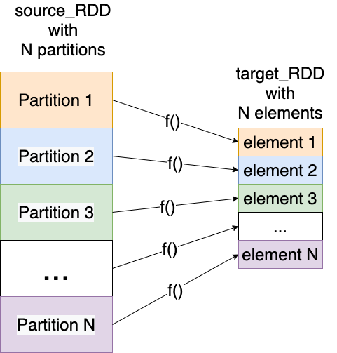
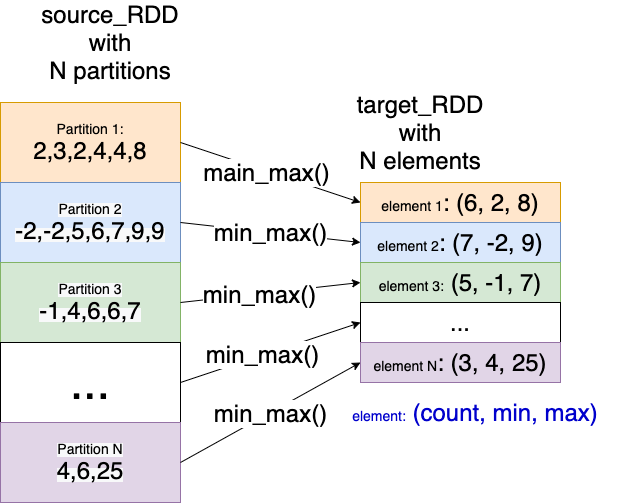

# Spark's mapPartitions()

Complete [PySpark solutions](./python) are provided.

According to Spark API: ````mapPartitions(func)```` 
transformation is similar to ````map()````, but runs 
separately on each partition (block) of the RDD, so 
`func` must be of type `Iterator<T> => Iterator<U>`
when running on an RDD of type T. Note that `map()` operates
on each element of an RDD, while `mapPartitions()` operates
on a single partition (comprised of thousands or millions
of elements).

In the following Figure, `f()` is a custom function,
which handles one partition at a time. Note that if
`source_RDD` has N partitions, then `target_RDD` will
have N elements.

~~~python
# Parameter: single_partition denotes a "single partition", 
# which is comprised of many elements
def f(single_partition):
  #...iterate single_partition (one element at a time)
  #...and return your desired summarized value (such as 
  #...tuple, array, list, dictionary, ...)
#end-def

target_RDD = source_RDD.mapPartitions(f)
~~~




The `pyspark.RDD.mapPartitions()` transformation 
should be used when you want to extract some condensed 
(small) information (such as finding the minimum and 
maximum of numbers) from each partition. For example, 
if you want to find the minimum and maximum of all 
numbers in your input, then using ````map()```` can be 
pretty inefficient, since you will be generating tons 
of intermediate `(K, V)	` pairs, but the bottom line is 
you just want to find two numbers: the minimum and maximum 
of all numbers in your input. Another example can be if 
you want to find top-10 (or bottom-10) for your input, 
then `mapPartitions()`  can work very well: find the 
top-10 (or bottom-10) per partition, then find 
the top-10 (or bottom-10) for all partitions: this way 
you are limiting emitting too many intermediate `(K, V)`
pairs.


# Example-1: Sum Each Partition
The following is a simple example of adding numbers 
per partition:


~~~python
>>> numbers = [1, 2, 3, 4, 5, 6, 7, 8, 9, 10]
>>> numbers
[1, 2, 3, 4, 5, 6, 7, 8, 9, 10]

>>> rdd = sc.parallelize(numbers, 3)

>>> rdd.collect()
[1, 2, 3, 4, 5, 6, 7, 8, 9, 10]

>>> rdd.getNumPartitions()
3

>>> def f(iterator):
...   print ("elements: ", list(iterator))
...
>>> rdd.foreachPartition(f)
elements: 1, 2, 3
elements: 7, 8, 9, 10
elements: 4, 5, 6

>>> def adder(iterator):
...   yield sum(iterator)
...
>>> rdd.mapPartitions(adder).collect()
[6, 34, 15]

~~~


# Example-2: Find Minimum and Maximum

Use ````mapPartitions()```` and find the minimum and maximum from each partition.



To make it a cleaner solution, we define a python function to return 
the minimum and maximum for a given partition/iteration.

~~~python
# returns (count, min, max) per partition
# iterator represents a single partition (comprised of many elements)
def min_max(iterator):
  firsttime = True
  local_count = 0
  #local_min = 0
  #local_max = 0
  for x in iterator:
    local_count += 1
    if (firsttime):
      local_min = x
      local_max = x
      firsttime = False
    else:
      local_min = min(x, local_min)
      local_max = max(x, local_max)
    #end-if
  #end-for
  return [(local_count, local_min, local_max)]
#end-def
~~~

Now create a source `RDD[Integer]` and then apply  `mapPartitions()`:

~~~python
>>> # spark : SparkSession object
>>> data = [10, 20, 3, 4, 5, 2, 2, 20, 20, 10]
>>> rdd = spark.sparkContext.parallelize(data, 3)
>>> mapped = rdd.mapPartitions(min_max)
>>> mapped.collect()
[(3, 3, 20), (3, 2, 5), (4, 2, 20)]

>>> # perform final reduction
>>> minmax_list = mapped.collect()
>>> count = sum(minmax_list[0])
>>> count
10
>>> minimum = min(minmax_list[1])
>>> minimum
3
>>> maximum = max(minmax_list[2])
>>> maximum
20
~~~

Note that you may perform final reduction by `RDD.reduce()` as well:

~~~python
>>> # spark : SparkSession object
>>> data = [10, 20, 3, 4, 5, 2, 2, 20, 20, 10]
>>> rdd = spark.sparkContext.parallelize(data, 3)
>>> mapped = rdd.mapPartitions(min_max)
>>> mapped.collect()
[(3, 3, 20), (3, 2, 5), (4, 2, 20)]
>>>
>>> # perform final reduction
>>> # x = (count1, min1, max1)
>>> # y = (count2, min2, max2)
>>> final_min_max = mapped.reduce(lambda x, y: (x[0]+y[0], min(x[1],y[1]), max(x[2],y[2])))
>>> final_min_max
(10, 3, 20)
~~~


NOTE: data  can be huge, but for understanding 
the `mapPartitions()` we used a very small data set.

# Is `RDD.mapPartitions()` Scalable?
The RDD.mapPartitions() is scalable, since we return a single element
from each source RDD partition (comprised of many elements). Even if 
the number of partitions in source RDD is high, still it will not cause a 
problem. You need to make sure that you custom function is not a bottleneck.
For example, if source RDD has 100,000 partitions, then the target RDD will
have 100,000 elements, which is very simple to apply a final reduction to
the target RDD. Again, make sure that you custom function is simple and 
efficient.


# Questions/Comments

* [View Mahmoud Parsian's profile on LinkedIn](http://www.linkedin.com/in/mahmoudparsian)
* Please send me an email: mahmoud.parsian@yahoo.com
* [Twitter: @mahmoudparsian](http://twitter.com/mahmoudparsian)

Thank you!

````
best regards,
Mahmoud Parsian
````

